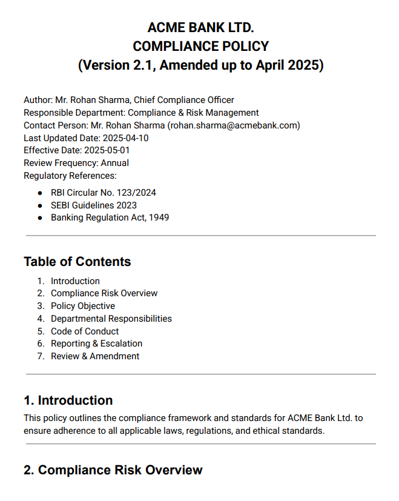
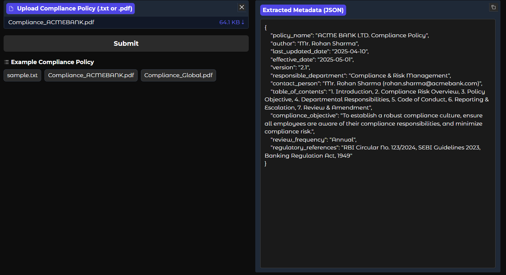
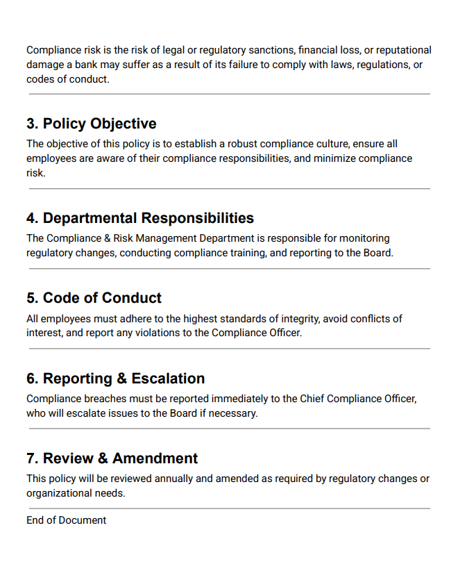

# 🏦 AI Compliance Metadata Extractor

**AI-powered tool for extracting structured metadata from compliance policy documents (PDF or TXT) using the power of LLMs — no API needed!**

## 🔗 App Link

🚀 Check out the live demo on <strong>Hugging Face Spaces</strong>: 
👉 <a href="https://huggingface.co/spaces/kushh108/compliance-metadata-extractor" target="_blank">
AI Powered Compliance Metadata Extractor
</a>

---

## 📌 Scope

Organizations often have hundreds of compliance documents spread across teams and formats. Manually tracking key metadata like **policy names**, **owners**, and **last updated dates** is inefficient and error-prone.

> This tool solves that by **automatically extracting compliance metadata using a open-source large language model - TinyLlama**, enabling fast policy cataloging, audits, and reporting.

---
## 🎯 Why This Matters

✅ **Time-saving**: Automates a manual, repetitive task  
✅ **Risk-reduction**: Improves compliance audit readiness  
✅ **Privacy-focused**: No need to send data to third-party APIs  
✅ **Deployable**: Ready for integration in enterprise workflows  

---

## 🚀 What This Does

- 🗃️ **Takes PDF or plain text** files of compliance policies
- 🔍 **Extracts metadata** fields like: Policy name, author, version, dates, department, contact, Table of contents
- 🧠 Uses a lightweight **open-source LLM** (no API keys)
- 🎛️ User-friendly **Gradio App Interface**
- 📄 Outputs results in structured JSON and .txt formats

---

## 🛠 Tech Stack

| Tool | Role |
|------|------|
|  | 🐍 Core programming language |
|    **TinyLlama** | 🤖 Large Language Model |
|  | 🧾 PDF text extraction |
|  | 🎛 User interface for file input/output |
|  | 📦 Model loading and tokenizer support |
|  | 🧠 LLM backend for inference |

---
## 📦 How to Run Locally

1. **Clone the repository**
2. **Install dependencies**
3. **Run the app**
4. Open your browser at [http://127.0.0.1:7860](http://127.0.0.1:7860)
5. (Optional) To get a public link, set `share=True` in `app.py` in the `demo.launch()` line

## Results
| 📝 Compliance Document (Input) | 📤 Extracted Metadata (Output) |
|:-----------------------------:|:------------------------------:|
|  |  |
|  |

**You may try it live using the app link above.**  
**Processing time may vary depending on the size of the document.**

## ⚠️ Limitations

- ❌ The current setup struggles with **very large PDF or text files**, potentially leading to memory overload or timeouts errors.
- ❌ Model may misclassify or omit metadata in complex or unstructured documents.
- 🧠 TinyLlama is a lightweight model optimized for simplicity and speed—not for deep semantic understanding.
- 📄 Currently supports only **English-language** PDFs.
- 🛠 Metadata fields are hardcoded; adding new types requires manual updates to the extraction pipeline.
- 🔐 Sensitive keys or tokens must be manually redacted before pushing to public platforms.

---

## 🚀 Scope for Improvement

### 🧠 Model Upgrades
- ⚡ Integrate **powerful open-source LLMs** such as:
  - 🔹 **Mistral-7B** – A robust and fast model for complex text understanding.
  - 🔹 **Mixtral** – A sparse mixture-of-experts model great for multitask comprehension.
  - 🔹 **Phi-2** by Microsoft – Small yet surprisingly accurate for task-specific compliance QA.

### 🚫 Why Not Mistral-7B?

**Mistral-7B** is a **robust** and **high-performing open-weight model** well-suited for complex text understanding tasks. However, it comes with **significant system requirements**:

- 🧠 **Requires 16–32 GB of GPU VRAM**  
- 💻 **Needs ≥48 GB of system RAM**  
- ⚙️ Optimized for high-end GPUs like **NVIDIA A100**, **RTX 3090**, or **RTX 4090**

⚠️ **Due to limited hardware availability and system resource constraints**, implementing Mistral-7B was not feasible for this project.

✅ Instead, the **TinyLlama** model was selected as a **lightweight**, efficient, and deployable alternative for resource-constrained environments.

### 🌍 Feature Enhancements
- 🌐 Add **multilingual support** for international compliance policies.
- 📊 Build an **interactive dashboard** to visualize extracted metadata and trends.
- 🤖 Use **retrieval-augmented generation (RAG)** for context-aware metadata extraction.
- 🔧 **Modularize the architecture** to easily switch between LLMs and adapt pipelines by domain.
- ☁️ Enable **cloud deployment** (e.g., Hugging Face Hub + Inference API) for scalable, on-demand usage.

---

## 👨‍💻 Author

**Kushal Tiwari**  
**Building AI with Language Models & Automation:** Passionate about real-world AI/ML and data science applications

---

## 📬 Contact

- 📧 **Email**: [23f3000514@ds.study.iitm.ac.in](mailto:23f3000514@ds.study.iitm.ac.in)
- 💼 **LinkedIn**: [linkedin.com/in/yourprofile](https://www.linkedin.com/in/yourprofile)
- 🌐 **Portfolio**: [yourwebsite.dev](https://yourwebsite.dev)

---

